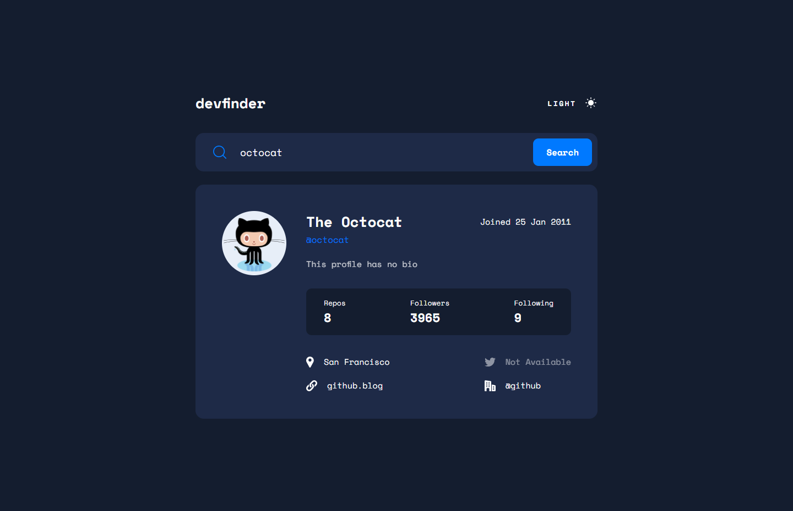

# REST Countries API with color theme switcher

  <h3>
    <a href="https://catherineisonline.github.io/rest-countries/" color="white">
      Live
    </a>
     | 
    <a href="https://www.frontendmentor.io/solutions/rest-countries-api-with-color-theme-switcher-SySqXmn49">
      Solution
    </a>
  </h3>

 
 

## About The Project

In this project, you'll use the GitHub users API to pull profile data and display it. It's a great challenge if you're looking to practice working with a 3rd-party API.

## Built with

- Semantic HTML5 markup
- CSS custom properties
- Flex
- Desktop-first workflow
- Github API
- sass
- react
- vite
